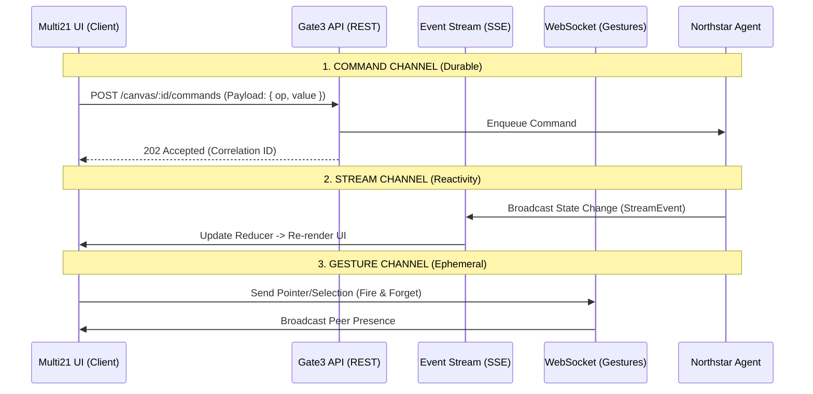

# Multi21 Real-Time Architecture Specification
> **Status:** LIVE (v1.0)
> **Protocol:** Gate3 Hybrid Transport
> **Backend:** Northstar Engine (Port 8000)

## 1. Transmission Architecture
Multi21 uses a **Hybrid Transport** model that separates *durable intent* from *ephemeral gestures*. This ensures reliability for agent instructions while maintaining low latency for collaborative features.



---

## 2. Upstream (Sending to Agents/Backend)
Changes originating from the UI (User Actions) are classified into two types: **Commands** and **Gestures**.

### A. Commands (State Mutations)
**Protocol:** HTTP POST (standard REST)
**Endpoint:** `POST /canvas/{canvas_id}/commands`
**Reliability:** High (Idempotent, Retryable)

Used for all functional changes (e.g., "Add Atom", "Change Config", "Run Agent").

**Payload Structure:**
```json
{
  "type": "command",
  "command": "update_tool",
  "payload": {
    "target": { "toolId": "grid.cols", "entityId": "global" },
    "op": "setValue",
    "value": 4
  },
  "correlation_id": "uuid-v4",
  "context": { "user_id": "u_123", "project_id": "p_abc" }
}
```

### B. Gestures (Presence & Focus)
**Protocol:** WebSocket
**Endpoint:** `ws://{host}/msg/ws?ticket={auth_ticket}`
**Reliability:** Low (Fire & Forget, latest data wins)

Used for high-frequency, non-critical data (e.g., "User is looking at Atom X", "Mouse moving").

**Payload Structure:**
```json
{
  "type": "gesture",
  "data": {
    "type": "cursor",
    "x": 100,
    "y": 200,
    "focus_id": "atom_header_1"
  }
}
```

---

## 3. Downstream (Receiving from Agents/Backend)
The UI listens to a single **Server-Sent Events (SSE)** stream for all "Source of Truth" updates.

**Protocol:** Server-Sent Events (EventSource / Fetch Stream)
**Endpoint:** `GET /sse/canvas/{canvas_id}`

### Stream Event Types
The backend pushes events that the UI Reducer consumes to update local state.

| Event Type | Description | Payload Example |
| :--- | :--- | :--- |
| `state.patch` | JSON Patch to update Canvas Model | `[{ op: "replace", path: "/grid/cols", value: 4 }]` |
| `agent.think` | Agent thought process (streaming text) | `{ "text": "Analyzing...", "done": false }` |
| `console.log` | **Remote Logging** (See Section 4) | `{ "level": "info", "msg": "Tool executed" }` |
| `safety.block` | Guardrail intervention | `{ "reason": "Policy Violation" }` |

---

## 4. Remote Logging Logic
Logging is treated as a first-class stream citizen. The backend transmits logs to the frontend via the SSE stream, allowing the "Console" in Multi21 to show backend execution traces in real-time.

**Log Event Structure (Downstream):**
```ts
interface ConsoleEvent {
    type: "console.log" | "console.error";
    timestamp: "ISO-8601";
    payload: {
        message: string;
        details?: any;
        agent_id?: string;     // Which agent generated the log
        execution_id?: string; // Correlates to a specific command
    }
}
```

### Implementation Details
*   **Context:** `ConsoleContext.tsx`
*   **Transport:** `lib/gate3/transport/index.ts`
*   **Handling:** The `processEvent` method in `CanvasTransport` dispatches these events to the `ConsoleContext` reducer, which appends them to the visible log array.

---

## 5. Security & Context
Every request is contextualized via Headers.

*   `Authorization`: `Bearer {token}`
*   `X-Tenant-Id`: Multi-tenancy isolation.
*   `X-Project-Id`: Workspace isolation.
*   `X-User-Id`: Auditing.

**Handshake:**
1.  Client requests Ticket (`POST /auth/ticket`).
2.  Client establishes WebSocket with Ticket.
3.  Client establishes SSE with Bearer Token.
