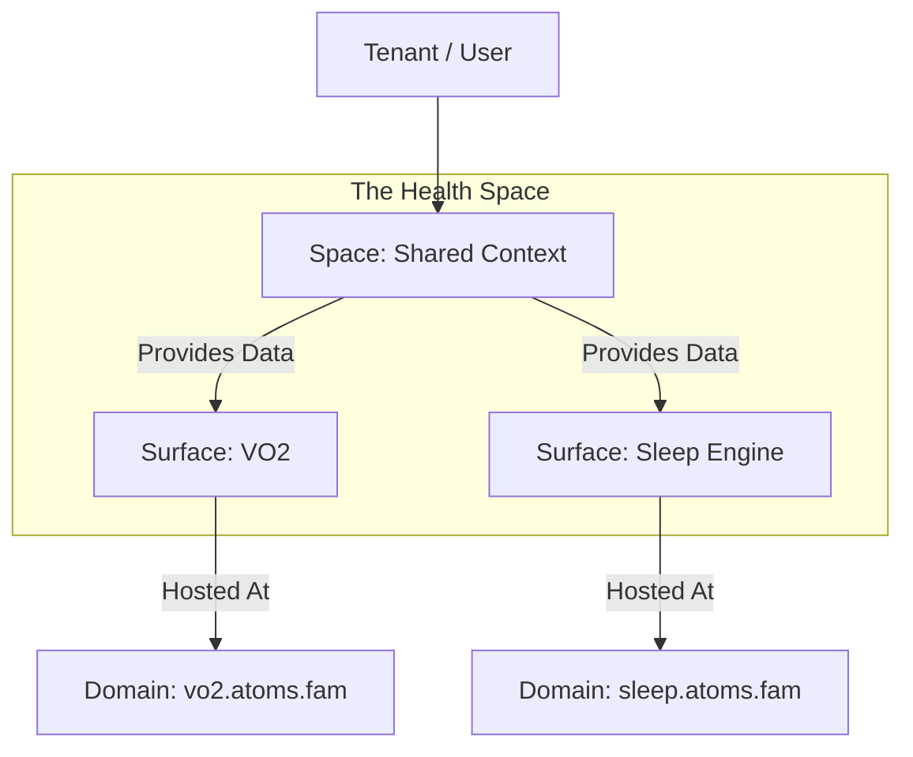

# Nexus Architecture: Spaces, Domains & Surfaces

**Status:** ALIGNED (V2.0)
**Date:** 2026-01-27
**Vision:** "Atoms Fam is the Operating System."

## 1. The Core Definitions

We have moved away from "Monolithic Apps". We are building **Agent Flows**.

### A. The Consumer (Identity)
1.  **Tenant**: The Billing Unit / Organization. (Can act as a User).
2.  **User**: The Human Operator within a Tenant.

### B. The Context (Truth)
3.  **Space** (The Context): The Shared Nexus.
    *   **Role**: Bounds the Memory (Vectors), File Storage, and Configs.
    *   *Examples*: `Health`, `Business`, `Finance`, `Knowledge`.
    *   *Relation*: Multiple Surfaces can share ONE Space. (e.g., `VO2` and `Sleep` both read from `Health` Space).

### C. The Interface (The Flow)
4.  **Surface** (The Flow Container): The "Place" where work happens.
    *   **Role**: A container for **Agent Flows** and **Canvases**. NOT an App.
    *   *Mechanism*: It loads multiple Canvases into the Harness.
    *   *Examples*: `AGNˣ` (Marketing Surface), `=MC²` (Health Surface).

### D. The Access (The Web)
5.  **Domain** (The URL): The Address.
    *   **Role**: Maps a URL to a Surface.
    *   **Examples**: `marketing.atoms.fam` -> `AGNˣ`, `body.atoms.fam` -> `=MC²`.

---

## 2. The Relationship Hierarchy

## 3. Data Storage (LanceDB on S3)

Path Structure:
`s3://.../{tenant_id}/spaces/{space_key}/vectors.lance`

*   **Logic**: If I am in the `VO2` Surface, I write to the `Health` Space vector store.
*   **Magic**: When I open the `Sleep` Surface, it reads from the SAME `Health` Space vector store. It knows everything.

## 4. The Registry (Supabase)

### `public.spaces`
*   `key`: 'health'
*   `name`: 'Health & Vitality'

### `public.domains`
*   `url`: 'marketing.atoms.fam'
*   `surface_key`: 'agnx'

### `public.surfaces`
*   `key`: 'agnx'
*   `space_key`: 'business'
