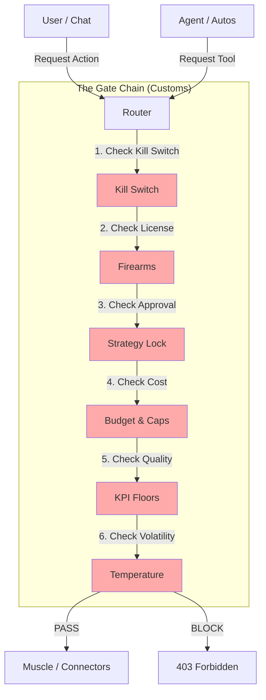

# Northstar Safety Architecture: The "Gate Chain" & "Central Spine"

**Status**: Architecture Explanation
**Target**: Understanding the "One Place" for Safety & Logging.

---

## 1. The "Gate Chain": Your Central Customs Check
You asked: *"Why isn't there one place that everything goes through?"*
**Answer**: There is. It is called the **Gate Chain** (`engines/nexus/hardening/gate_chain.py`).

Think of the **Gate Chain** as the **Security Checkpoint** at an airport. Every single passenger (Agent, Chat User, Canvas Operation) *must* pass through this checkpoint before they can get on a plane (use Muscle/Tools).

### How it works (The Flow)
Every major action (sending a message, running a tool, updating a canvas) triggers a call to `GateChain.run()`.

### What gets checked?
1.  **Kill Switch**: "Is the system panicked?" (Global Stop).
2.  **Firearms**: "Does this user/agent have a *license* to use this specific tool?" (e.g., `youtube.upload`).
3.  **Strategy Lock**: "Does this dangerous action require a human 'Three Wise Men' approval?"
4.  **Budget**: "Can we afford this?" (Cost & Daily Caps).
5.  **KPI**: "Is the quality variance too high?" (Floors/Ceilings).
6.  **Temperature**: "Is the system running too hot/volatile?"

**If ANY gate fails, the action is BLOCKED immediately.**

---

## 2. The "Central Spine": One Log to Rule Them All
You asked: *"All of the logging should all have this one place."*
**Answer**: It does. It is the **Event Spine** (`DatasetEvent`).

Every component (Gate Chain, Chat, Connectors) emits events into a **Single Standard Envelope** (`engines/dataset/events/schemas.py`).

-   **Audit Logs**: Use the Spine.
-   **Billing**: Uses the Spine.
-   **Debug Traces**: Uses the Spine.
-   **Safety Decisions**: Use the Spine.

This means you can plug **one consumer** (like `events/engine.py` or an external listener) into the spine to see *everything* happening in the entire OS.

---

## 3. MCP vs. Internal Connectors
You asked: *"Where does MCP fit? Do we want an Internal MCP?"*

### The Distinction
1.  **One-Way Connectors (The "Tendrils")**:
    -   These are code in `engines/connectors/` (Shopify, YouTube, etc.).
    -   They are **wrapped** by the Gate Chain.
    -   *Example*: An agent wants to tweet. It calls `twitter.post`. The Gate Chain checks "Does Agent have Twitter License?". If yes, it calls the Connector.

2.  **MCP Gateway (External Tools)**:
    -   This is for allowing Northstar to use *other people's* tools (like a generic MCP server).
    -   These should **ALSO** be wrapped by the Gate Chain.
    -   *Recommendation*: Treat an external MCP server just like an internal Connector. Wrap it in a proxy that enforces the Gates.

3.  **Internal MCP (Exposing Northstar)**:
    -   This is if you want *other apps* (like Claude Desktop) to use Northstar's tools.
    -   You would build an `MCP Server` that sits *in front* of the Gate Chain, so external users are still subject to your safety rules.

### Summary
-   **Everything** (Chat, Canvas, Tools) flows through the **Gate Chain**.
-   **Everything** logs to the **Central Spine**.
-   **Connectors** are just "Muscles" that get guarded by the Gate Chain.
