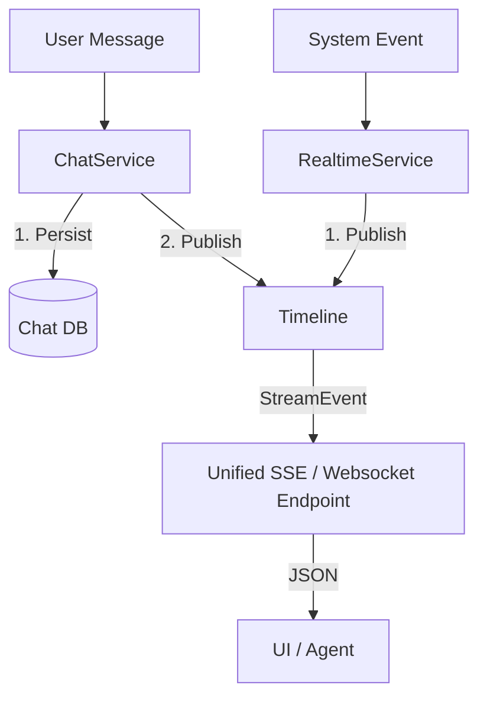

# Northstar Realtime Architecture: The "Dual Bus" & The Timeline

**Status**: Architecture Reality Check
**Target**: Understanding how Realtime & Chat actually flow.

---

## 1. Is there a "Centralised Way"?
**Yes and No.**

Currently, there are **Two Parallel Buses** that handle realtime traffic, but they both converge into **One Unifying Record** called the **Timeline**.

### Path A: The Chat Bus (Interactive)
-   **Source**: `engines/chat/service/transport_layer.py`
-   **Mechanism**: `InMemoryBus` (or `RedisBus` if config is set).
-   **Flow**:
    1.  User sends message.
    2.  `publish_message()` saves to DB (`chat_store`).
    3.  Pushes to `bus` (for active WebSocket listeners).
    4.  **Emits to Timeline**.

### Path B: The Realtime "Feed" Bus (System)
-   **Source**: `engines/realtime/broadcaster.py`
-   **Mechanism**: Ad-hoc `_local_broadcast` queues.
-   **Flow**:
    1.  System event occurs (e.g., Feed update, Graph change).
    2.  `emit_feed_update()` pushes to local memory queues.
    3.  **Should Emit to Timeline** (currently separate in code).

---

## 2. The Unifier: The "Timeline"
You asked for a centralised way. The closest thing we have implemented is the **Timeline** (`engines/realtime/timeline.py`).

The Timeline is designed to be the single sorted stream of *everything* that happens in a context (User + AI + System).

**The Ideal Flow (and how to fix it):**
Instead of listeners checking the "Chat Bus" AND the "Feed Bus", they should just listen to the **Timeline**.

### Current Reality Risk
-   **Chat** interacts with Timeline correctly (`_message_to_stream_event`).
-   **Feeds/Broadcaster** (`broadcaster.py`) is currently **isolated** using its own `_subscribers` list.
-   **Fix**: We need to make `broadcaster.py` publish to `Timeline` instead of its private queue.

## 3. Usage for You
To get "The Realtime", you connect to **one endpoint**:
`GET /realtime/events` (which reads from Timeline).

If you stick to this endpoint, you get the "Centralised Way" you want, provided we ensure all subsystems (like Feeds) publish to the Timeline.
